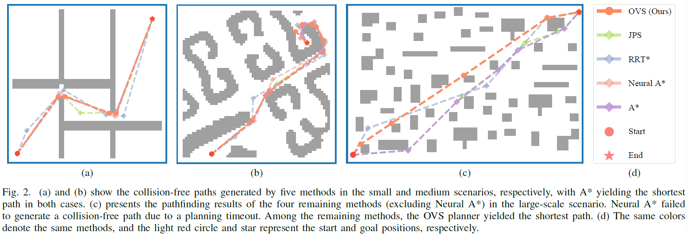
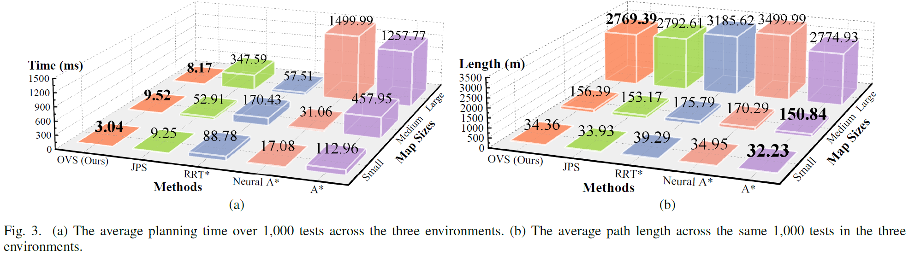
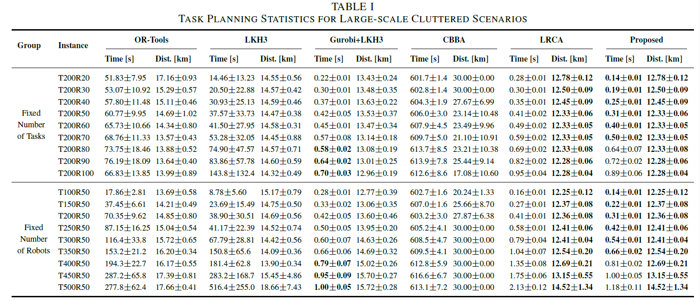
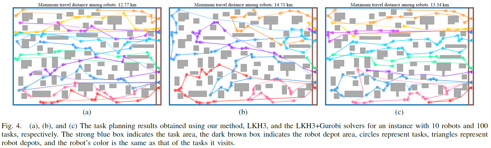

# Efficient Multi-robot Task and Path Planning in Large-Scale Cluttered Environments

We present the implementation of an efficient multi-robot task and path planning (**MRTPP**) method for robot coordination in cluttered environments. The source code of our method, along with the compared state-of-the-art (SOTA) solvers, is implemented in Python.

Description
-----

As the potential of multi-robot systems continues to be explored and validated across various real-world applications, such as package delivery, search and rescue, and autonomous exploration, the need to improve the efficiency and quality of task and path planning has become increasingly urgent, particularly in large-scale, obstacle-rich environments. To this end, this letter investigates the problem of multi-robot task and path planning (MRTPP) in large-scale cluttered scenarios. Specifically, we first propose an obstacle-vertex search (OVS) path planner that quickly constructs the cost matrix of collision-free paths for multi-robot task planning, ensuring the rationality of task planning in obstacle-rich environments. Furthermore, we introduce an efficient auction-based method for solving the MRTPP problem by incorporating a novel memory-aware strategy, aiming to minimize the maximum travel cost among robots for task visits. The proposed method effectively improves computational efficiency while maintaining solution quality in the multi-robot task planning problem. Finally, we demonstrated the effectiveness and practicality of the proposed method through extensive benchmark comparisons.   

About
-----

**Paper**: [Efficient Multi-robot Task and Path Planning in Large-Scale Cluttered Environments](https://arxiv.org/abs/2409.06531)  

**Authors**: Gang Xu, Yuchen Wu, Sheng Tao, Yifan Yang, Tao Liu, Tao Huang, Huifeng Wu, and Yong Liu  

**Accepted to**: IEEE Robotics and Automation Letters (**RA-L**), 2025

**Code**: The source code will be released soon.

Experimental Results
-----

#### Evaluation of Path Planners

    

    

#### Comparisons in Large-scale Cluttered Environments

    

    

Citation
-----

