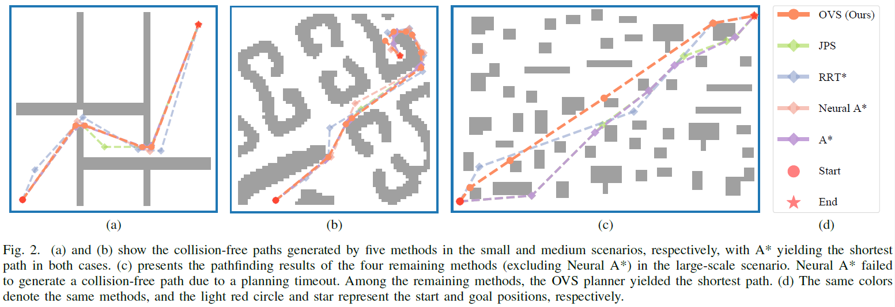
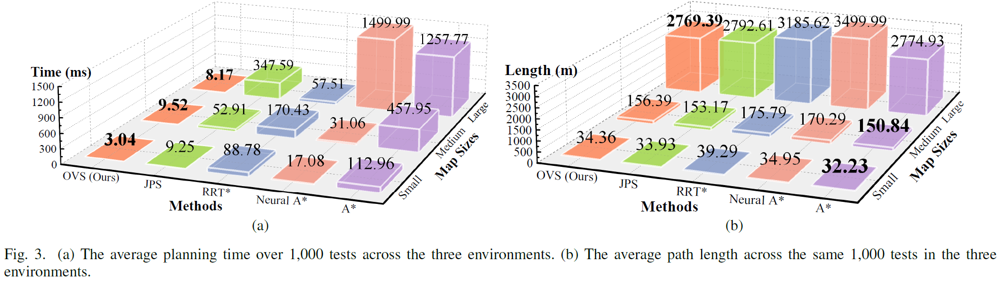
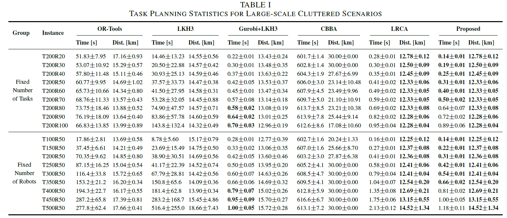
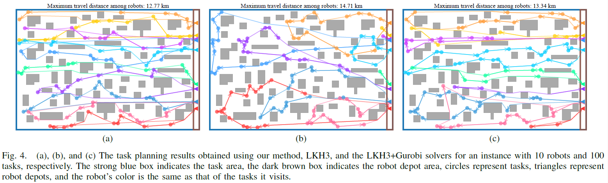

# Efficient Multi-robot Task and Path Planning in Large-Scale Cluttered Environments

Description
-----

We present the implementation of an efficient multi-robot task and path planning (**MRTPP**) method for multi-robot coordination in large-scale cluttered environments. The source code of our method, along with the compared state-of-the-art (SOTA) solvers, is implemented in Python and publicly available here. 

**The main contributions are summarized as follows:** 1) A fast path planner suitable for large-scale and cluttered workspaces that efficiently constructs the cost matrix of collision-free paths between tasks and robots for solving the MRTPP problem. 2) An efficient auction-based method for solving the MRTPP problem by incorporating a novel memory-aware strategy, aiming to minimize the maximum travel cost for robots to visit tasks. 

About
-----

**Paper**: [Efficient Multi-robot Task and Path Planning in Large-Scale Cluttered Environments](https://ieeexplore.ieee.org/abstract/document/11091464)  

**Authors**: Gang Xu, Yuchen Wu, Sheng Tao, Yifan Yang, Tao Liu, Tao Huang, Huifeng Wu, and Yong Liu  

**Published: IEEE Robotics and Automation Letters (RA-L)**, 2025

**Code**: The source code will be released soon.

Experimental Results
-----

#### Evaluation of Path Planners

<p align="center">
    
</p>

<p align="center">
    
</p>

#### Comparisons in Large-scale Cluttered Environments

<p align="center">
    
</p>

<p align="center">
    
</p>
Requirement
-----

```python
# Install version 3.0.7 of LKH.
wget http://akira.ruc.dk/~keld/research/LKH-3/LKH-3.0.7.tgz
tar xvfz LKH-3.0.7.tgz
cd LKH-3.0.7
make
sudo cp LKH /usr/local/bin

# The Python interpreter is version 3.8.
# Running 'ovs_lmtaPolicy.py' will yield the task planning results of the proposed method for the given example.
# Running 'ovsPlanner.py' will yield the path planning results of the proposed OVS planner for the given example.
# Running 'general_config.py' can generate the robot's position and the target positions to be visited, thereby creating the distance matrix information.
```

-----

Citation
-----

```
@article{xu2025efficient,
  author={Xu, Gang and Wu, Yuchen and Tao, Sheng and Yang, Yifan and Liu, Tao and Huang, Tao and Wu, Huifeng and Liu, Yong},
  journal={IEEE Robotics and Automation Letters}, 
  title={Efficient Multi-Robot Task and Path Planning in Large-Scale Cluttered Environments}, 
  year={2025},
  volume={10},
  number={9},
  pages={9112-9119},
  doi={10.1109/LRA.2025.3592146}
}
```

